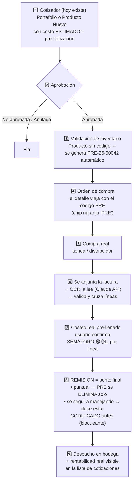

# FARMY — Plan maestro de implementación: costeo real, código PRE y OCR de facturas

**Documento consolidado, listo para pasar a la rama principal.** Reúne en orden de ejecución todo lo definido en los docs [03](03-costeo-real-cotizaciones.md) y [04](04-codigo-pre-y-ocr-facturas.md).

---

## 1. El flujo completo (qué estamos construyendo)



### Reglas de oro (decididas)

1. La cotización aprobada **no se toca**: precios de venta, cantidades y totales quedan congelados. El costeo real es una capa encima.
2. **El OCR propone, el humano dispone**: nada se guarda sin confirmación del usuario.
3. **La remisión es el punto final del código PRE**: queda bloqueado, no se puede hacer nada más con él y se elimina (borrado lógico automático). Un consecutivo PRE nunca se reutiliza.
4. Ninguna fila se borra físicamente (histórico intacto); "eliminar" = desaparece de todo el sistema activo.
5. Permisos con el sistema existente de acciones (`RequiereAccion` + directiva `hasAction`).

---

## 2. Paso a paso de implementación (7 entregas, cada una usable por sí sola)

### 📦 ENTREGA 1 — Base de datos (medio día)

> Una sola migración EF Core: `AddCosteoRealYProductoProvisional`

- [ ] **1.1** `CotizacionDetalle` — columnas nuevas:
  `CostoRealUnitario`, `CostoRealTotal`, `GananciaReal`, `PorcentajeGananciaReal` (decimal 18,2), `FuenteCompra` (PORTAFOLIO | TIENDA | OTRO), `IdCotizacionFactura?`
- [ ] **1.2** `CotizacionEncabezado` — columnas nuevas:
  `TotalCostoReal`, `TotalGananciaReal`, `PorcentajeGananciaReal`, `CosteoCompleto` (bit)
- [ ] **1.3** Tabla nueva **`CotizacionFactura`**:
  `IdCotizacionFactura`, `IdCotizacion`, `NumeroFactura`, `ProveedorOTienda`, `FechaCompra`, `ValorFactura`, `RutaArchivo`, `NombreArchivoOriginal`, `IdUsuarioRegistro`, `FechaRegistro`, `Estado`, y campos OCR: `OcrEstado`, `OcrJson`, `OcrConfianza`, `FechaLectura`
- [ ] **1.4** Tabla nueva **`ProductoProvisional`**:
  `IdProductoProvisional`, `CodigoPre` (único), `NombreProducto`, `IdCotizacion`, `IdCotizacionDetalle`, `Estado` (ACTIVO | CODIFICADO | ELIMINADO | VENCIDO), `FechaCreacion`, `FechaCierre?`, `IdCodificacion?`, `CodigoBarrasDefinitivo?`, `IdUsuarioCierre?`, `ObservacionCierre?`
- [ ] **1.5** Tabla nueva **`CotizacionCosteoBitacora`**:
  `IdCotizacion`, `IdCotizacionDetalle`, `CostoAnterior`, `CostoNuevo`, `IdUsuario`, `Fecha`
- [ ] **1.6** Configuraciones Fluent API en `Persistence/Configurations/` (una por tabla, patrón existente) + registrar DbSets en `AppDbContext`

**Criterio de aceptación:** migración aplica y revierte limpia; el sistema actual sigue funcionando sin cambios.

---

### 🔌 ENTREGA 2 — API de costeo real (1–2 días)

> Módulo `Modules/Comercial/Cotizaciones` (servicios y controller existentes)

- [ ] **2.1** `PUT /api/Cotizacion/{id}/costeo` — recibe `[{ idCotizacionDetalle, costoRealUnitario, fuenteCompra? }]`; valida estado = **Aprobada**; recalcula por línea (`GananciaReal = (PrecioVenta − CostoReal) × Cantidad`, `%Real = (1 − costoReal/precioVenta) × 100` — misma fórmula de margen sobre venta del cotizador) y totales del encabezado; escribe bitácora
- [ ] **2.2** `POST /api/Cotizacion/{id}/facturas` — multipart (pdf/jpg/png, tamaño máx. por config); guarda archivo en `Storage:CotizacionFacturas` (carpeta configurable, **fuera del repo**) + fila en `CotizacionFactura`
- [ ] **2.3** `GET /api/Cotizacion/{id}/facturas` y `DELETE .../facturas/{idFactura}` (anula, no borra)
- [ ] **2.4** `GET /api/Cotizacion/{id}/rentabilidad` — comparativo por línea y total: estimado vs real + desviación
- [ ] **2.5** Acción nueva **`COSTEAR_COTIZACION`** protegiendo los endpoints con `[RequiereAccion]`
- [ ] **2.6** Validaciones: solo Aprobadas aceptan costeo; el costeo jamás modifica venta/cantidades

**Criterio de aceptación:** desde Swagger se puede costear una cotización aprobada de punta a punta y ver el comparativo.

---

### 🖥️ ENTREGA 3 — Front: dialog "Costeo real" (2–3 días)

> `pages/modules/comercial/cotizaciones/`

- [ ] **3.1** Botón **"💲 Costeo real"** en cada fila de la lista de Cotizaciones — visible solo si estado = Aprobada y el usuario tiene `COSTEAR_COTIZACION` (directiva `hasAction`)
- [ ] **3.2** `costeo-real.dialog` nuevo:
  - Grid de líneas: producto, cantidad, precio venta (RO), costo estimado (RO), **costo real (editable)**, ganancia real y % (auto)
  - Marcar por línea nueva: "¿se seguirá manejando?" (Sí → deberá codificarse antes de remisionar / No → compra puntual)
  - Sección facturas: adjuntar archivo + número, proveedor/tienda, fecha, valor; lista de facturas cargadas
  - Totales: venta · costo estimado vs real · ganancia estimada vs real, con semáforo
- [ ] **3.3** Guardar → `PUT /costeo`; sin recargar la página completa

**Criterio de aceptación:** el equipo comercial registra costos y facturas sin abrir el formulario del cotizador.

---

### 📊 ENTREGA 4 — Visibilidad de rentabilidad (1 día)

- [ ] **4.1** Columnas nuevas en la lista de Cotizaciones: "Ganancia real", "% real", chip "Costeo" (Completo | Parcial | Pendiente)
- [ ] **4.2** Semáforo por cotización: 🟢 real ≥ estimado · 🟡 dentro de tolerancia (±3% config) · 🔴 por debajo
- [ ] **4.3** Incluir columnas reales en el export a Excel existente

**Criterio de aceptación:** gerencia ve de un vistazo qué cotizaciones ganaron menos de lo cotizado.

---

### 🏷️ ENTREGA 5 — Código provisional PRE (2 días)

- [ ] **5.1** Generación automática al aprobar cotización con líneas "Producto Nuevo" sin código: formato `PRE-{AA}-{consecutivo}` (servicio + consecutivo en BD, idempotente)
- [ ] **5.2** El PRE viaja en `OrdenCompraDetalle.CodigoBarras` (texto libre — **sin cambio de esquema**); chip naranja "PRE" en gestor de pedidos, OC y recepción
- [ ] **5.3** `POST /api/ProductoProvisional/generar`, `GET /api/ProductoProvisional?estado=`, `PUT .../{id}/codificar` (crea `Codificacion` real con el flujo existente Por confirmar → Confirmado y guarda mapeo PRE → definitivo)
- [ ] **5.4** **Hook en `RemisionService`** (el punto final): al crear la remisión —
  - PRE puntuales → `ELIMINADO` automático (borrado lógico: desaparece de todo el sistema activo)
  - PRE "se seguirá manejando" sin codificar → **bloquea la remisión** con mensaje de qué falta
  - Después de remisionar: el PRE no se puede usar, editar ni reactivar
- [ ] **5.5** Aviso al aprobar: "Se generaron N códigos provisionales (…)"
- [ ] **5.6** Pestaña "Códigos provisionales" en Codificaciones (filtro por estado)

**Criterio de aceptación:** un producto nuevo fluye cotización → OC → remisión y al final no queda ningún PRE activo.

---

### 🤖 ENTREGA 6 — OCR de facturas + semaforización (3–4 días)

- [ ] **6.1** `FacturaOcrService`: HttpClient tipado hacia la **API de Claude con visión** (mismo patrón de `WaBotClaudeService`); envía PDF/imagen, recibe JSON estructurado (proveedor, NIT, número, fecha, líneas, totales, confianza)
- [ ] **6.2** Al subir factura (2.2) se dispara la lectura en segundo plano; `GET /api/Facturas/{id}/ocr` devuelve resultado + validaciones + propuesta de matching
- [ ] **6.3** Validaciones en orden: duplicada (NIT+número, bloqueante) → aritmética de totales → matching de líneas (por PRE / código de barras / similitud de descripción; dudosos a confirmación manual) → cantidades → costo vs estimado
- [ ] **6.4** `POST /api/Facturas/{id}/aplicar-costeo`: aplica **solo lo confirmado por el usuario** al costeo real
- [ ] **6.5** En el dialog: botón "🤖 Leer factura" → extracto + cruces + confirmación → costos pre-llenados → semáforo por línea (🔴 exige observación para guardar)
- [ ] **6.6** Estados de factura: `CARGADA → LEIDA | ERROR_LECTURA → VALIDADA → APLICADA`

**Criterio de aceptación:** una factura de tienda se lee, cruza y aplica al costeo en menos de un minuto, con confirmación humana.

---

### 🧹 ENTREGA 7 — Red de seguridad y cierre (1–2 días)

- [ ] **7.1** Job diario (HostedService, patrón `WaReasignacionService`): PRE sin movimiento en N días (config, propuesta 30) → `VENCIDO`
- [ ] **7.2** Reporte de vencidos en la pestaña de Codificaciones: codificar (rescate) o eliminar manualmente
- [ ] **7.3** `CosteoCompleto` en encabezado cuando todas las líneas tienen costo real; chip en la lista
- [ ] **7.4** Bitácora visible (quién cambió qué costo y cuándo) en el dialog

**Criterio de aceptación:** cero códigos PRE huérfanos posibles: o los cierra la remisión, o los caza el job.

---

## 3. Resumen de esfuerzo y orden

| # | Entrega | Duración | Depende de |
|---|---|---|---|
| 1 | Base de datos | 0,5 día | — |
| 2 | API costeo real | 1–2 días | 1 |
| 3 | Dialog costeo real | 2–3 días | 2 |
| 4 | Visibilidad rentabilidad | 1 día | 3 |
| 5 | Código PRE + hook remisión | 2 días | 1, 2 |
| 6 | OCR + semáforo | 3–4 días | 3, 5 |
| 7 | Job vencidos + cierre | 1–2 días | 5 |
| | **Total estimado** | **≈ 2,5–3 semanas** | |

Las entregas 3–4 y 5 pueden ir en paralelo si hay dos personas.

---

## 4. Configuración nueva (`appsettings`)

```json
{
  "Storage": { "CotizacionFacturas": "D:\\FarmyStorage\\Facturas" },
  "Costeo": {
    "ToleranciaSemaforoPorc": 3,
    "DiasVencimientoPre": 30,
    "TamanoMaxFacturaMB": 10
  },
  "FacturaOcr": { "Habilitado": true, "Modelo": "claude-sonnet-5" }
}
```

*(Llaves de Claude por variables de entorno / user-secrets, nunca en el repo.)*

---

## 5. Decisiones

**Cerradas ✅**

- La remisión es el punto final del PRE: bloqueo + eliminación automática; codificación obligatoria previa si el producto se seguirá manejando.
- El costeo real nunca modifica la venta aprobada.
- OCR con Claude API (ya integrada en Farmy); el usuario siempre confirma.
- Borrado lógico, nunca físico; consecutivos PRE no se reutilizan.

**Abiertas ❓ (con propuesta por defecto)**

1. Días para vencer un PRE que nunca llegó a remisión → **30**
2. Tolerancia del semáforo → **±3%**
3. ¿El PRE se genera al aprobar la cotización (automático) o en un paso manual previo a la OC? → **automático al aprobar**
4. ¿Arrancar el OCR desde el inicio o aplazar la entrega 6 si el volumen de facturas es bajo? → **incluirla**
