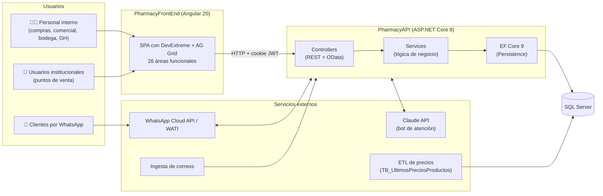
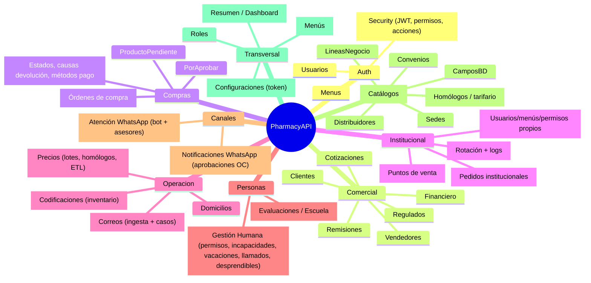
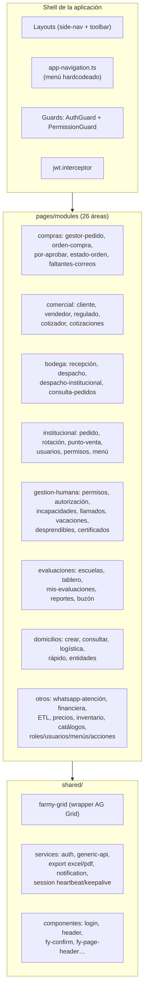
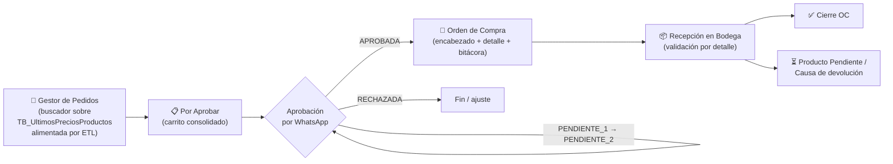
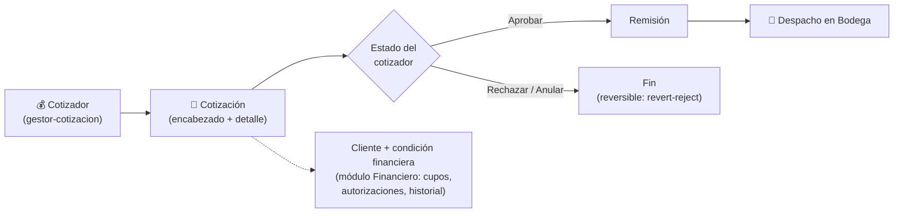
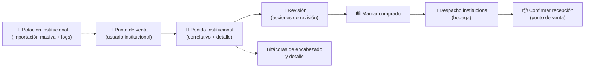
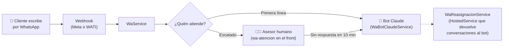
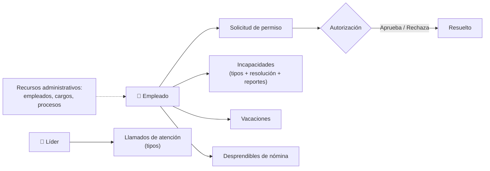
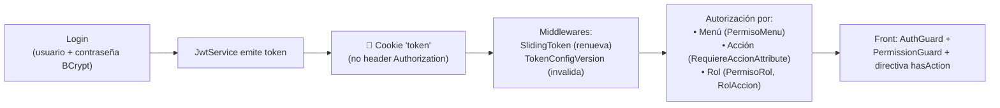

# FARMY — Modelo actual del sistema (a hoy)

Este documento describe **cómo está organizado Farmy hoy**, de forma didáctica: la arquitectura general, los módulos que existen, los procesos de negocio y cómo funciona la seguridad.

---

## 1. Vista de pájaro: ¿qué es Farmy?

Farmy es un **ERP farmacéutico** compuesto por dos aplicaciones que conversan entre sí:

**En una frase:** el front Angular consume la API .NET, que concentra toda la lógica y persiste en SQL Server; además la API habla con WhatsApp (aprobaciones y atención al cliente con bot de Claude), recibe correos y se apoya en una ETL externa que alimenta la tabla de precios/productos.

---

## 2. Stack tecnológico

| Capa | Tecnología | Notas |
|---|---|---|
| Frontend | Angular 20 (standalone components) | Sin NgModules |
| UI | DevExtreme 25 + AG Grid 35 + Angular Material + Bootstrap 5 | **4 librerías de UI conviviendo** |
| Exportaciones | ExcelJS, xlsx, jsPDF + autotable | Excel y PDF desde el front |
| Backend | ASP.NET Core 8, C# | API REST + OData (`$filter`, `$expand`…) |
| ORM | Entity Framework Core 9 | Fluent API en `Persistence/Configurations` (60+ archivos) |
| BD | SQL Server | Única base de datos |
| Auth | JWT en **cookie** + BCrypt | Sliding token + versionado de configuración de token |
| Mensajería | WhatsApp Cloud API o WATI (conmutables por config) | `IWaGateway` decide el canal |
| IA | Claude API (`WaBotClaudeService`) | Bot de primera línea en WhatsApp |
| Docs API | Swagger | Solo en desarrollo |

---

## 3. Mapa de módulos del backend (PharmacyAPI)

La API se organiza en **módulos por dominio**, cada uno con `Controllers / Services / Models / DTO`:

**Números de hoy:** 21 carpetas de módulos + `Auth`, ~70 servicios registrados en `DependencyInjection.cs`, 60+ entidades configuradas en el `AppDbContext`.

> ⚠️ El README de la API dice "14 módulos": está desactualizado, hoy hay 21.

---

## 4. Mapa del frontend (PharmacyFrontEnd)

**Cómo llega el usuario a una pantalla:** `app.routes.ts` (todas las rutas **importadas de forma eager**) → guards de sesión y permisos → componente de la feature → servicios compartidos → API.

---

## 5. Procesos de negocio principales

### 5.1 Compras: del pedido a la recepción en bodega

La aprobación usa **plantillas de WhatsApp** con dos niveles de verificadores (`PENDIENTE_1`, `PENDIENTE_2`, `APROBADA`, `RECHAZADA` en `VerificacionEstados`), gestionadas por el módulo `Notificaciones/WhatsApp`.

### 5.2 Comercial: de la cotización a la remisión

### 5.3 Institucional: pedidos de puntos de venta

Este módulo tiene su **propio subsistema de usuarios, menús y permisos** (`UsuarioInstitucional`, `MenuInstitucional`, `PermisoUsuarioInstitucional`), paralelo al general.

### 5.4 Atención por WhatsApp (bot + asesores)

### 5.5 Gestión Humana

### 5.6 Otros procesos activos

- **Evaluaciones / Escuela Farmy:** escuelas → módulos → contenidos → evaluaciones → progreso e intentos → reportes (avance, semestral) + buzón de convivencia.
- **Domicilios:** creación (normal y rápida), logística, consulta, entidades y clientes de domicilio.
- **Correos:** ingesta por API key → casos de correo → clasificación en el front (`clasificacion-correos`, `faltantes-correos`).
- **Precios:** carga master ETL, lotes de precios, homólogos, comparación de estados (`Up/Down/Equal`), stock.
- **Dashboard (Resumen):** compras, evolución, rotación, tiempos de entrega.

---

## 6. Seguridad y permisos (cómo funciona hoy)

**Dato clave:** existen **tres sistemas de permisos** conviviendo:

1. **General:** `Usuario` + `Rol` + `PermisoUsuario/PermisoAccion/PermisoMenu` (+ `PermisoRol`, `RolAccion`).
2. **Institucional:** `UsuarioInstitucional` + `MenuInstitucional` + `PermisoUsuarioInstitucional`.
3. **Menús duplicados:** hay un modelo `Menu` en `Auth/Menus` y otro en `Modules/Menus`.

---

## 7. Radiografía en números

| Métrica | Valor |
|---|---|
| Módulos backend | 21 + Auth |
| Servicios en DI | ~70 (registro manual, sin interfaces) |
| Entidades EF | 60+ |
| Áreas del front | 26 |
| Componente más grande | `gestor-cotizacion` → **3.990 líneas** |
| Otros componentes >1.800 líneas | orden-compra (2.606), gestor-pedido (2.586), cotizaciones (2.140), despacho (2.050), recepción (1.881) |
| `Program.cs` | **2.108 líneas** (incluye seeds y utilidades dev) |
| Migraciones EF | 1 (+ `EnsureCreated` para desarrollo) |
| Tests | 0 en API; solo esqueleto en el front |

➡️ Continúa en: [**Propuesta de reestructuración**](02-propuesta-reestructuracion.md)
