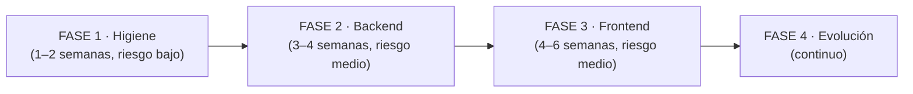

# FARMY — Propuesta de reestructuración

Basado en el [modelo actual](01-modelo-actual-farmy.md), este documento lista los **problemas estructurales detectados** y propone un **plan de cambios por fases**, ordenado de menor a mayor riesgo. La idea: cada fase deja el sistema funcionando y mejor que antes.

---

## 1. Hallazgos estructurales

### Backend (PharmacyAPI)

| # | Hallazgo | Impacto | Severidad |
|---|---|---|---|
| B1 | `Program.cs` de **2.108 líneas**: seeds SQL, utilidades `--ensure-db` / `--seed-productos` y configuración mezcladas | Difícil de leer y mantener; arranque frágil | 🔴 Alta |
| B2 | **Dos módulos WhatsApp paralelos**: `Modules/AtencionWhatsApp` y `Modules/Notificaciones/WhatsApp` con servicios, webhooks y modelos propios | Lógica duplicada, dos webhooks, confusión sobre dónde tocar | 🔴 Alta |
| B3 | **Menús duplicados**: modelo `Menu` en `Auth/Menus` y otro en `Modules/Menus` | Ambigüedad de fuente de verdad | 🔴 Alta |
| B4 | **Tres sistemas de permisos** (general, roles y institucional) sin abstracción común | Cada cambio de seguridad se hace 2–3 veces | 🔴 Alta |
| B5 | ~70 servicios **sin interfaces** (salvo `IWaGateway`) y registro manual en `DependencyInjection.cs`; `DesprendibleService` registrado 2 veces | Imposible mockear → bloquea tests; DI frágil | 🟠 Media |
| B6 | **Una sola migración EF** + `EnsureCreated` | El esquema no es reproducible ni versionado | 🟠 Media |
| B7 | Carpetas inconsistentes: `Service` vs `Services`, `DTO` en singular/plural | Fricción diaria y errores de namespace | 🟡 Baja |
| B8 | Archivos que no deberían estar en el repo: `wa-media/` (audios .m4a/.webm, imágenes), `CREATE PROCEDURE sp_ActualizarUltimosPre.txt` dentro de `Services/`, `Tools/ImportEmpleados.cs` (702 líneas de utilidad puntual) | Repo pesado y confuso | 🟡 Baja |
| B9 | **0 tests** | Cualquier refactor es a ciegas | 🔴 Alta |
| B10 | README dice 14 módulos; hay 21 | Documentación engañosa para nuevos devs | 🟡 Baja |
| B11 | `appsettings.json` con la estructura completa de secretos (JWT, AES, WhatsApp tokens) en el repo | Riesgo de que un secreto real termine commiteado | 🟠 Media |

### Frontend (PharmacyFrontEnd)

| # | Hallazgo | Impacto | Severidad |
|---|---|---|---|
| F1 | **Componentes gigantes**: `gestor-cotizacion` 3.990 líneas, `orden-compra` 2.606, `gestor-pedido` 2.586, `despacho` 2.050… La lógica de negocio vive en los componentes | Imposible de testear y de reutilizar; merge conflicts constantes | 🔴 Alta |
| F2 | **Sin lazy loading**: `app.routes.ts` importa los ~70 componentes de forma eager | Bundle inicial enorme; arranque lento | 🔴 Alta |
| F3 | **Navegación duplicada**: menú hardcodeado en `app-navigation.ts` y a la vez menús/permisos en BD | Dos fuentes de verdad; pantallas nuevas exigen tocar ambos | 🟠 Media |
| F4 | **4 librerías de UI**: DevExtreme + AG Grid + Angular Material + Bootstrap | Peso, inconsistencia visual, 4 formas de hacer un grid/diálogo | 🟠 Media |
| F5 | Estructura de carpetas inconsistente: features sueltas (`homologo`, `distribuidor`, `convenios`) junto a agrupadas (`comercial/`, `compras/`); nombres que no coinciden con la ruta (`homologo` ↔ `/tarifario`) ni con la API (`inventario` ↔ `Codificaciones`) | Cuesta encontrar el código de una pantalla | 🟡 Baja |
| F6 | Servicios compartidos "cajón de sastre" en `shared/services` (auth junto a export-pdf junto a diploma) | Sin fronteras por dominio | 🟡 Baja |
| F7 | Código muerto: `dark-old.css`, e2e de plantilla, componente `modulo-proximamente` para rutas vacías | Ruido | 🟡 Baja |

---

## 2. Plan por fases



### FASE 1 — Higiene del repositorio (riesgo bajo, sin tocar comportamiento)

1. **Limpiar `Program.cs`**: extraer los seeds y utilidades a clases dedicadas:
   ```
   PharmacyAPI/
   ├── Program.cs                    # < 150 líneas: solo pipeline
   ├── Configuration/
   │   ├── DependencyInjection.cs
   │   ├── ODataConfiguration.cs
   │   ├── AuthenticationSetup.cs    # JWT + cookie (nuevo)
   │   ├── CorsSetup.cs              # (nuevo)
   │   └── SwaggerSetup.cs           # (nuevo)
   └── Persistence/Seed/
       ├── DevDatabaseSeeder.cs      # --ensure-db, --seed-productos
       └── sql/                      # scripts SQL versionados (incluye sp_ActualizarUltimosPrecios)
   ```
2. **Sacar del repo**: `wa-media/` (añadir a `.gitignore`; los medios van a disco/blob storage), el `.txt` con el stored procedure (→ `Persistence/Seed/sql/`), `Tools/ImportEmpleados.cs` (→ proyecto aparte o script).
3. **Unificar nombres de carpetas**: todo `Services/` y `DTOs/` (plural). Es un rename mecánico de namespaces.
4. **Corregir DI**: eliminar el registro duplicado de `DesprendibleService`.
5. **Secretos**: dejar en `appsettings.json` solo claves vacías + `appsettings.Development.json` ignorado; usar `dotnet user-secrets` en local y variables de entorno en producción.
6. **Actualizar README** (14 → 21 módulos, mapa real).
7. Front: borrar `dark-old.css`, e2e de plantilla y demás código muerto.

### FASE 2 — Reestructuración del backend

1. **Unificar WhatsApp en un solo módulo** con dos submódulos y un único webhook de entrada:
   ```
   Modules/WhatsApp/
   ├── Gateway/            # IWaGateway, WaMetaService, WaWatiService (canal)
   ├── Atencion/           # conversaciones, bot Claude, reasignación
   ├── Aprobaciones/       # aprobación de órdenes de compra
   └── Webhooks/           # UN solo controller de webhook que enruta
   ```
2. **Unificar menús**: una sola entidad `Menu` con campo de ámbito (`General` | `Institucional`) y eliminar el modelo duplicado de `Auth/Menus`.
3. **Unificar permisos**: un solo motor de autorización (usuario → roles → acciones/menús) con el ámbito institucional como un caso más, no como un subsistema clonado. Migración de datos incluida.
4. **Interfaces + registro por convención**: extraer `IXxxService` para los servicios con lógica real y registrar por convención (Scrutor) para reducir `DependencyInjection.cs` de 70 líneas manuales a un scan.
5. **Migraciones reales**: generar `InitialCreate` desde el snapshot actual, abandonar `EnsureCreated`, y de aquí en adelante toda alteración de esquema pasa por migración.
6. **Tests de caracterización** para los 4 servicios críticos antes de tocarlos: `CotizacionService`, `OrdenCompraService`, `PedidoInstitucionalService`, `PrecioService` (proyecto `PharmacyAPI.Tests` con SQLite/InMemory).

### FASE 3 — Reestructuración del frontend

1. **Lazy loading por feature**: reemplazar los imports eager por `loadComponent`/`loadChildren`:
   ```ts
   // app.routes.ts (después)
   {
     path: 'comercial',
     loadChildren: () => import('./features/comercial/comercial.routes'),
     canActivate: GUARDS,
   }
   ```
2. **Estructura por features** alineada con los módulos de la API:
   ```
   src/app/
   ├── core/                 # auth, interceptors, guards, session, config
   ├── features/
   │   ├── comercial/        # cliente, vendedor, regulado, cotizador…
   │   ├── compras/
   │   ├── bodega/
   │   ├── institucional/
   │   ├── gestion-humana/
   │   ├── evaluaciones/
   │   ├── domicilios/
   │   ├── catalogos/        # sede, convenio, distribuidor, tarifario, línea…
   │   └── administracion/   # usuarios, roles, menús, acciones, config
   └── shared/               # farmy-grid, pipes, fy-* components, export
   ```
3. **Partir los componentes gigantes**: patrón por feature = componente contenedor (orquesta) + componentes de presentación + **servicio de feature/store** con la lógica y llamadas a la API. Empezar por `gestor-cotizacion` (3.990 líneas) como piloto: separar grid, formulario, totales y exportación.
4. **Navegación desde la API**: el menú ya existe en BD con permisos; el front debería construir la navegación desde ahí y eliminar `app-navigation.ts` como fuente paralela (o dejarlo solo como fallback).
5. **Converger a una librería de grid/UI**: AG Grid ya tiene wrapper propio (`farmy-grid`); definir que grids nuevos = `farmy-grid`, diálogos/forms = una sola librería, y migrar oportunistamente lo demás. Meta: retirar al menos una de las 4 librerías.

### FASE 4 — Evolución continua

- **CI**: build + tests + lint en cada PR (GitHub Actions) para ambos repos.
- **Fronteras de módulo**: si el equipo crece, evaluar separar la solución en proyectos (`Farmy.Comercial`, `Farmy.Compras`…) manteniendo el monolito desplegable ("modular monolith"). No microservicios: el tamaño actual no lo justifica.
- **Observabilidad**: logging estructurado (Serilog) + health checks ampliados.
- **Documentación viva**: mantener estos diagramas junto al código y actualizarlos en cada PR que cambie estructura.

---

## 3. ¿Por dónde empezar mañana?

Orden sugerido de las primeras 5 acciones (máximo valor, mínimo riesgo):

1. Fase 1.1 — partir `Program.cs` (2 horas, cero riesgo funcional).
2. Fase 1.2/1.5 — limpiar repo y secretos (1 hora).
3. Fase 2.5 — congelar esquema con migración `InitialCreate` (medio día).
4. Fase 3.1 — lazy loading de rutas (1 día, mejora visible de arranque).
5. Fase 2.6 — primeros tests de caracterización de `CotizacionService` (base para todo lo demás).

> **Regla de oro para todo el plan:** nunca mezclar en un mismo PR un cambio de estructura (mover/renombrar) con un cambio de comportamiento. Así el diff siempre es revisable.
