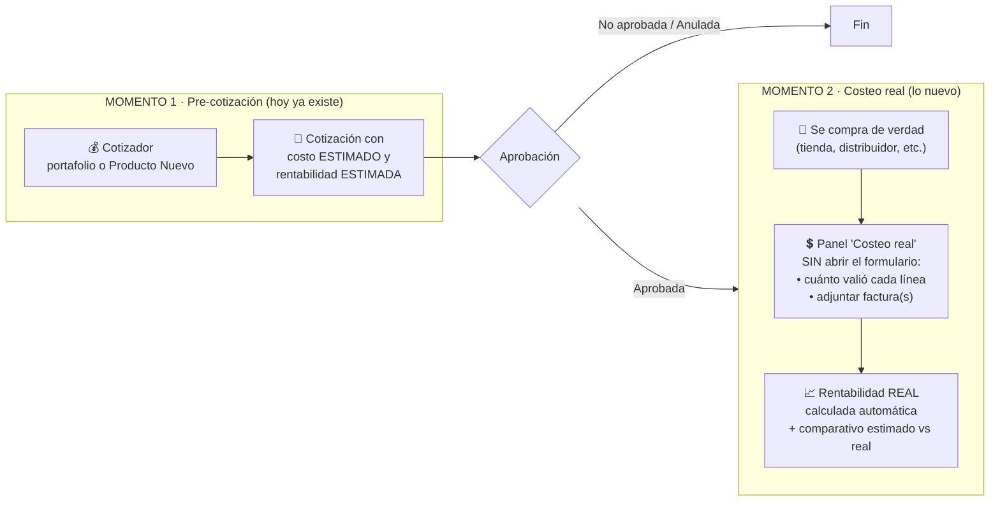
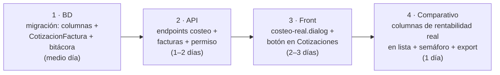

# FARMY — Mejora comercial: costeo real y rentabilidad de cotizaciones aprobadas

## 1. El problema (en una frase)

Cuando una cotización incluye **productos comprados por fuera del portafolio** ("Producto Nuevo": tiendas, compras rápidas), el precio con el que se cotiza es un **estimado**. Hoy, después de que la cotización queda **Aprobada** y la compra real ya se hizo, no hay dónde registrar **cuánto valió de verdad**, ni adjuntar la **factura**, ni ver la **rentabilidad real** — y hacerlo obligaría a reabrir el formulario completo del cotizador.

### Lo que existe hoy en el código

| Pieza | Estado actual | Limitación |
|---|---|---|
| `CotizacionDetalle` | `PrecioUnitario`, `PrecioVenta`, `Ganancia`, `PorcentajeGanancia` | Todo calculado sobre el costo **estimado**; no hay campo de costo real |
| `CotizacionEncabezado` | `FacturaAsociada` (string de 30 caracteres) | Un solo número de factura, sin archivo, sin valor, sin proveedor/tienda |
| Cotizador (front) | Badge "Producto Nuevo" / "Producto Pendiente" por línea | El origen de compra no se persiste de forma estructurada |
| Estados | Pendiente → **Aprobada** / No Aprobada / Anulada | Tras "Aprobada" no existe ninguna acción de costeo |

---

## 2. El concepto: separar dos momentos



**Regla de oro:** la cotización aprobada **no se toca** (precios de venta, cantidades y totales quedan congelados). El costeo real es una capa que se agrega encima, con su propia bitácora.

---

## 3. Flujo de usuario propuesto

1. En la pantalla **Cotizaciones** (lista), toda cotización en estado **Aprobada** muestra una acción nueva: **"💲 Costeo real"**.
2. Se abre un panel (dialog) — *no* el formulario del cotizador — con:
   - **Grid de líneas**: producto, cantidad, precio de venta (solo lectura), costo estimado (solo lectura), **costo real unitario (editable)**, ganancia real y % (calculados solos al escribir).
   - **Sección de facturas**: adjuntar una o varias (archivo PDF/imagen + número, proveedor o tienda, fecha, valor).
   - **Totales**: venta total · costo estimado vs costo real · ganancia estimada vs real, con semáforo (🟢 mejor de lo esperado, 🟡 igual, 🔴 por debajo).
3. Guardar actualiza solo los campos de costeo y deja registro en bitácora (quién, cuándo, valor anterior → nuevo).
4. Mientras una línea no tenga costo real, se muestra el estimado como referencia y la cotización aparece con costeo **incompleto**.

---

## 4. Cambios de datos (SQL Server / EF Core)

### 4.1 `CotizacionDetalle` — columnas nuevas

```csharp
public decimal? CostoRealUnitario { get; set; }      // decimal(18,2) — cuánto valió de verdad
public decimal? CostoRealTotal { get; set; }         // CostoRealUnitario × Cantidad
public decimal? GananciaReal { get; set; }           // (PrecioVenta − CostoRealUnitario) × Cantidad
public decimal? PorcentajeGananciaReal { get; set; } // (1 − costoReal/precioVenta) × 100  ← misma fórmula de margen sobre venta que usa hoy el cotizador
public string?  FuenteCompra { get; set; }           // 'PORTAFOLIO' | 'TIENDA' | 'OTRO' (persistir lo que hoy solo es un badge)
public int?     IdCotizacionFactura { get; set; }    // opcional: a qué factura pertenece la línea
```

### 4.2 Tabla nueva: `CotizacionFactura` (reemplaza al string `FacturaAsociada`)

```csharp
public class CotizacionFactura
{
    public int      IdCotizacionFactura { get; set; }
    public int      IdCotizacion { get; set; }
    public string   NumeroFactura { get; set; }      // MaxLength(50)
    public string?  ProveedorOTienda { get; set; }   // MaxLength(200) — "dónde se compró"
    public DateTime FechaCompra { get; set; }
    public decimal  ValorFactura { get; set; }       // decimal(18,2)
    public string   RutaArchivo { get; set; }        // PDF/imagen en storage configurable
    public string?  NombreArchivoOriginal { get; set; }
    public int      IdUsuarioRegistro { get; set; }
    public DateTime FechaRegistro { get; set; }
    public string   Estado { get; set; } = "A";      // anulable, nunca borrada física
}
```

> `FacturaAsociada` del encabezado se conserva por compatibilidad (lectura), pero lo nuevo se registra en `CotizacionFactura`. Varias facturas por cotización = varias tiendas para una misma venta.

### 4.3 `CotizacionEncabezado` — totales reales

```csharp
public decimal? TotalCostoReal { get; set; }
public decimal? TotalGananciaReal { get; set; }
public decimal? PorcentajeGananciaReal { get; set; }
public bool     CosteoCompleto { get; set; }   // true cuando TODAS las líneas tienen costo real
```

### 4.4 Bitácora

Tabla `CotizacionCosteoBitacora`: IdCotizacion, IdCotizacionDetalle, CostoAnterior, CostoNuevo, IdUsuario, Fecha. (Mismo patrón de las bitácoras que ya usan Compras e Institucional.)

---

## 5. API — endpoints nuevos (módulo `Comercial/Cotizaciones`)

| Método | Ruta | Qué hace |
|---|---|---|
| `PUT` | `/api/Cotizacion/{id}/costeo` | Recibe `[{ idCotizacionDetalle, costoRealUnitario, fuenteCompra? }]`; valida estado = Aprobada; recalcula línea y totales; escribe bitácora |
| `POST` | `/api/Cotizacion/{id}/facturas` | Multipart: archivo + metadatos (número, proveedor, fecha, valor). Guarda archivo en storage y fila en `CotizacionFactura` |
| `GET` | `/api/Cotizacion/{id}/facturas` | Lista facturas de la cotización (con URL de descarga) |
| `DELETE` | `/api/Cotizacion/{id}/facturas/{idFactura}` | Anula (estado 'I'), no borra |
| `GET` | `/api/Cotizacion/{id}/rentabilidad` | Comparativo por línea y total: estimado vs real + desviación |

**Reglas de negocio en `CotizacionService`:**

- Solo cotizaciones **Aprobadas** aceptan costeo (400 si no).
- El costeo **nunca** modifica `PrecioVenta`, `Cantidad` ni totales de venta.
- Permiso nuevo con el sistema existente: acción `COSTEAR_COTIZACION` protegida con `[RequiereAccion]` (así se controla quién puede registrar costos/facturas sin darle acceso al cotizador).
- Archivos: carpeta configurable en `appsettings` (`Storage:CotizacionFacturas`), tipos permitidos pdf/jpg/png, tamaño máximo definido por config — no repetir el patrón de `wa-media/` dentro del repo.

---

## 6. Front — pantallas y componentes

| Componente | Tipo | Contenido |
|---|---|---|
| `cotizaciones.component` (existente) | Acción nueva en la fila | Botón "💲 Costeo real" visible solo si estado = Aprobada y el usuario tiene la acción `COSTEAR_COTIZACION` (directiva `hasAction` existente) |
| `costeo-real.dialog` (nuevo, en `comercial/cotizaciones/`) | Dialog | Grid editable de líneas (solo columna costo real editable) + sección facturas + totales comparativos con semáforo |
| Columnas nuevas en la lista de cotizaciones | Grid | "Ganancia real", "% real", "Costeo" (chip: Completo / Parcial / Pendiente) |

**Detalle del dialog:**

```
┌─ Costeo real · COT-000123 · Cliente X · Aprobada ────────────────┐
│ Línea               Cant  Venta      Costo est.  COSTO REAL  Gan. real │
│ Acetaminofén …       10   42.000     33.500      [ 31.900 ]  🟢 +6%    │
│ Producto Nuevo Y      2   180.000    150.000     [________]  ⏳ pend.  │
├─ Facturas ────────────────────────────────────────────────────────┤
│ [+ Adjuntar factura]  FV-8821 · Droguería Z · 28/07 · $95.400 · 📄 │
├─ Totales ─────────────────────────────────────────────────────────┤
│ Venta $X · Costo est. $Y → real $Y' · Ganancia est. $Z → real $Z'  │
└──────────────────────────────────── [Cancelar] [Guardar costeo] ──┘
```

---

## 7. Orden de implementación sugerido (4 entregas pequeñas)



Cada entrega es usable por sí sola: tras la 2 ya se puede costear por API/Swagger; tras la 3 el equipo comercial ya lo usa; la 4 es visibilidad gerencial.

---

## 8. Fuera de alcance (por ahora, decisiones para después)

- Conciliar automáticamente la factura contra las líneas (OCR / matching) — primero manual.
- Costeo para cotizaciones **no aprobadas** — no aplica: el costo real solo existe tras la compra.
- Reportería de desviación estimado-vs-real por vendedor/período — natural como siguiente paso en el Dashboard (módulo Resumen) cuando haya datos acumulados.
