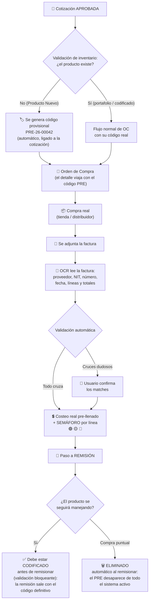
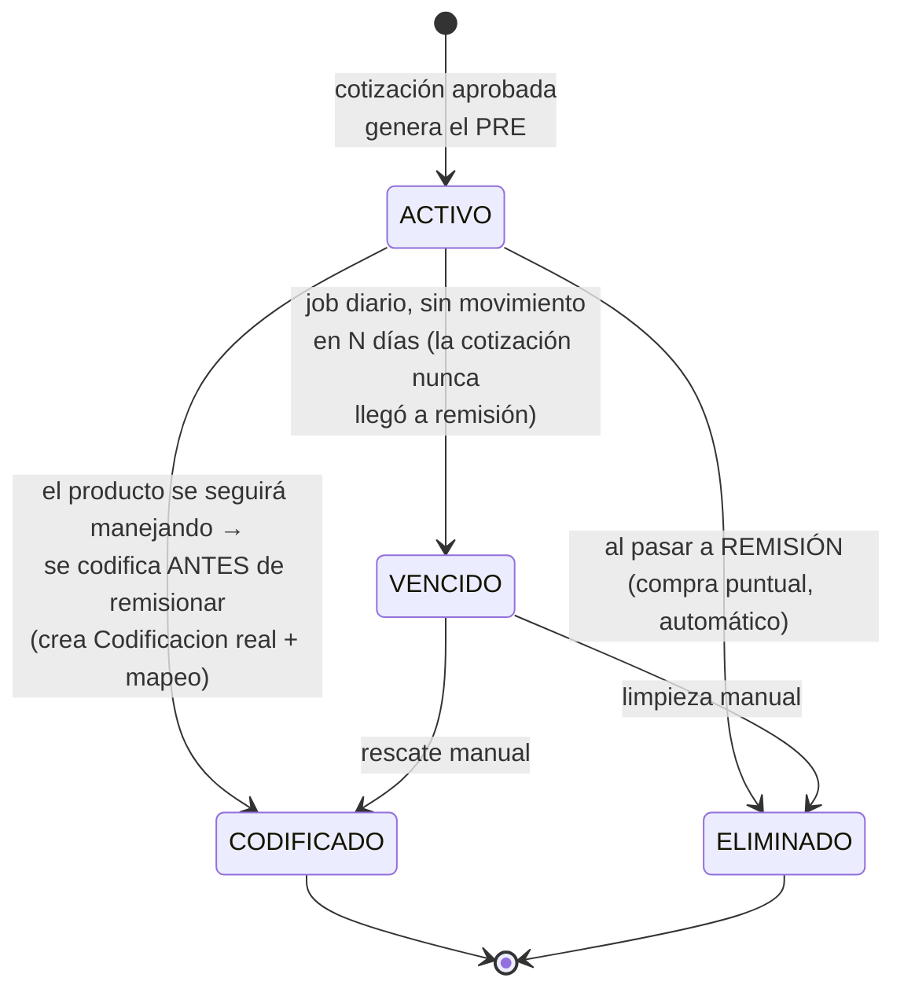
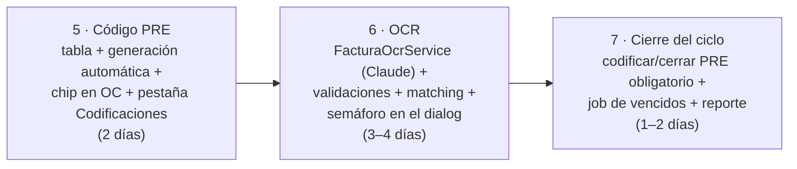

# FARMY — Producto nuevo de punta a punta: código provisional PRE, orden de compra y OCR de facturas

Continuación de [03 · Costeo real de cotizaciones](03-costeo-real-cotizaciones.md). Esta especificación cierra el ciclo completo cuando el producto **no existe en inventario**:

> Cotización aprobada → validación de inventario → **código provisional PRE** → orden de compra → factura leída por **OCR** → validación → **semaforización** → el código PRE termina **codificado o cerrado, nunca como basura**.

---

## 1. Los dos problemas nuevos

| Problema | Hoy | Riesgo si se hace mal |
|---|---|---|
| **A.** Una cotización aprobada con "Producto Nuevo" pasa a órdenes de compra, pero el producto no existe en inventario: no tiene código de barras ni codificación | El producto viaja solo como texto (`NombreProducto`) | Sin código no se puede rastrear en OC, recepción ni costeo |
| **B.** Si generamos códigos provisionales, pueden quedar huérfanos ("basura") cuando el proceso termina | No existen códigos provisionales | Inventario contaminado con códigos que nadie limpia |
| **C.** Registrar la factura a mano es lento y propenso a error | Campo de texto `FacturaAsociada` | Costeo real (doc 03) dependería de digitación manual |

---

## 2. Flujo completo propuesto



**La clave anti-basura:** el paso a **remisión es el punto final del código PRE**. Al remisionar, el código queda bloqueado (no se puede usar ni editar más) y se elimina automáticamente del sistema activo — no es una tarea aparte que alguien pueda olvidar. Para lo que nunca llegue a remisión (cotizaciones que se quedan a medias), hay un vencimiento automático (sección 3.3).

---

## 3. El código provisional PRE

### 3.1 Formato y generación

- Formato: `PRE-{AA}-{consecutivo}` → ej. `PRE-26-00042`. Corto, reconocible a simple vista y imposible de confundir con un código de barras real.
- Se genera **automáticamente** al aprobar una cotización que tenga líneas "Producto Nuevo" sin código (o al validar inventario, si ese paso es aparte). El usuario no lo digita.
- Viaja por la orden de compra **sin cambiar el esquema**: `OrdenCompraDetalle.CodigoBarras` es texto libre (100 chars) y lo transporta tal cual; en pantalla se muestra con un chip "PRE".

### 3.2 Tabla nueva: `ProductoProvisional` (la fuente de verdad)

```csharp
public class ProductoProvisional
{
    public int      IdProductoProvisional { get; set; }
    public string   CodigoPre { get; set; }              // PRE-26-00042, único, nunca reutilizado
    public string   NombreProducto { get; set; }
    public int      IdCotizacion { get; set; }           // dónde nació
    public int      IdCotizacionDetalle { get; set; }
    public string   Estado { get; set; }                 // ACTIVO | CODIFICADO | ELIMINADO | VENCIDO
    public DateTime FechaCreacion { get; set; }
    public DateTime? FechaCierre { get; set; }
    public int?     IdCodificacion { get; set; }         // si terminó CODIFICADO → FK al módulo Codificaciones
    public string?  CodigoBarrasDefinitivo { get; set; } // mapeo PRE → real (el histórico nunca se reescribe)
    public int?     IdUsuarioCierre { get; set; }
    public string?  ObservacionCierre { get; set; }
}
```

### 3.3 Ciclo de vida: la remisión es el punto final



Reglas:

1. **El paso a remisión cierra el PRE, siempre y automáticamente.** Al generar la remisión de la cotización: si el producto es de compra puntual, el PRE pasa a `ELIMINADO` sin intervención de nadie; si se va a seguir manejando, la remisión **exige** que ya esté codificado (validación bloqueante) y sale con el código definitivo.
2. Después de remisionar **no se puede hacer nada más** con ese PRE: ni usarlo en documentos nuevos, ni editarlo, ni reactivarlo (validación en API).
3. `ELIMINADO` se implementa como **borrado lógico**: el código desaparece de todas las búsquedas, listas y catálogos activos del sistema — para el usuario, se eliminó. La fila queda solo archivada internamente porque las cotizaciones y OC históricas la referencian y no pueden quedar apuntando al vacío.
4. Un consecutivo PRE **nunca se reutiliza**, para que un documento viejo jamás muestre el producto equivocado.
5. **Red de seguridad** para lo que nunca llegue a remisión: job diario (HostedService, mismo patrón de `WaReasignacionService`) marca como `VENCIDO` los PRE sin movimiento en N días, y una pestaña "Códigos provisionales" en Codificaciones lista los vencidos para codificarlos o eliminarlos manualmente.
6. Al codificar, la **codificación definitiva usa el flujo que ya existe** en el módulo Codificaciones (`Por confirmar → Confirmado → Rechazado`) — no se inventa un flujo paralelo. El PRE guarda el mapeo hacia el código definitivo.

---

## 4. Lector OCR de facturas

### 4.1 Tecnología recomendada

**Claude API con visión** — Farmy ya integra Claude (`WaBotClaudeService` del bot de WhatsApp), así que hay credenciales, patrón de servicio y experiencia. Se envía el PDF/imagen de la factura y se recibe JSON estructurado:

```json
{
  "proveedor": "Droguería Z S.A.S.", "nit": "900123456-7",
  "numeroFactura": "FV-8821", "fecha": "2026-07-28",
  "lineas": [
    { "descripcion": "ACETAMINOFEN 500MG CAJA X 100", "cantidad": 10,
      "valorUnitario": 3190, "valorTotal": 31900 }
  ],
  "subtotal": 95400, "iva": 0, "total": 95400,
  "confianza": "alta"
}
```

Alternativa sin IA (si se prefiere): Tesseract OCR + parsing propio — más barato por lectura, mucho más frágil con formatos de factura variados (tiendas ≠ distribuidores). Recomendación: **Claude para extraer, reglas propias para validar**.

### 4.2 Validaciones automáticas (en orden)

| # | Validación | Si falla |
|---|---|---|
| 1 | Factura duplicada (NIT + número ya registrados) | 🔴 Bloquea: no se puede aplicar dos veces |
| 2 | Aritmética: total = suma de líneas + IVA | 🟡 Advierte: el usuario revisa |
| 3 | **Matching de líneas** contra la cotización/OC: primero por código PRE o código de barras, luego por similitud de descripción | Cruces dudosos van a confirmación manual del usuario |
| 4 | Cantidad facturada vs cantidad ordenada | 🟡 Advierte diferencia |
| 5 | Costo facturado vs costo estimado → **semáforo** | Ver 4.3 |

**Principio: el OCR propone, el humano dispone.** La lectura pre-llena el costo real del doc 03; nada se guarda sin que el usuario confirme.

### 4.3 Semaforización (la misma del doc 03, ahora alimentada por el OCR)

Con tolerancia configurable (ej. ±3%):

- 🟢 **Verde** — costo real ≤ estimado: la rentabilidad real es igual o mejor que la cotizada.
- 🟡 **Amarillo** — dentro de la tolerancia, o advertencias de cantidad/aritmética: revisar y confirmar.
- 🔴 **Rojo** — costo real por encima del estimado (rentabilidad cayó) o descuadre fuerte: exige observación/justificación para poder guardar.

### 4.4 Estados de la factura

`CARGADA → LEIDA (OCR ok) | ERROR_LECTURA → VALIDADA (usuario confirmó cruces) → APLICADA (costeo actualizado)`

Campos nuevos en `CotizacionFactura` (doc 03): `OcrEstado`, `OcrJson` (resultado crudo para auditoría), `OcrConfianza`, `FechaLectura`.

---

## 5. API — endpoints nuevos

| Método | Ruta | Qué hace |
|---|---|---|
| `POST` | `/api/ProductoProvisional/generar` | Genera PRE para las líneas nuevas de una cotización aprobada (idempotente: no duplica) |
| `GET` | `/api/ProductoProvisional?estado=ACTIVO` | Lista/filtra (para la pestaña de Codificaciones y el reporte de vencidos) |
| `PUT` | `/api/ProductoProvisional/{id}/codificar` | Crea la `Codificacion` real (flujo existente) y guarda el mapeo |
| — | *(sin endpoint de cierre manual)* | La eliminación es **automática dentro de `RemisionService`**: al crear la remisión, los PRE puntuales pasan a `ELIMINADO` y los marcados "se seguirá manejando" bloquean la remisión si aún no están codificados |
| `POST` | `/api/Cotizacion/{id}/facturas` | (doc 03) ahora además **dispara la lectura OCR** en segundo plano |
| `GET` | `/api/Facturas/{id}/ocr` | Resultado de la lectura + validaciones + propuesta de matching |
| `POST` | `/api/Facturas/{id}/aplicar-costeo` | Aplica los costos confirmados por el usuario al costeo real (doc 03) |

Servicio nuevo: `FacturaOcrService` (patrón de `WaBotClaudeService`: HttpClient tipado hacia la API de Claude, prompt de extracción, deserialización estricta del JSON).

---

## 6. Front — qué ve el usuario

1. **Al aprobar** una cotización con productos nuevos: aviso "Se generaron 2 códigos provisionales (PRE-26-00042, PRE-26-00043)".
2. **En gestor de pedidos / OC / recepción**: chip naranja `PRE` junto al código, para que bodega sepa que es provisional.
3. **En el dialog de costeo real** (doc 03): botón **"🤖 Leer factura"** → muestra lo extraído, los cruces propuestos (con confianza), el usuario confirma → costos reales pre-llenados → semáforo por línea. Ahí mismo se marca si cada producto nuevo "se seguirá manejando" (para codificarlo antes de remisionar) o es compra puntual.
4. **Al remisionar**: si hay PRE de productos que se seguirán manejando y aún no están codificados, la remisión se bloquea con el mensaje claro de qué falta; los puntuales se eliminan solos y la remisión sale limpia. Después de este punto el PRE ya no existe para el usuario.
5. **En Codificaciones**: pestaña nueva "Códigos provisionales" con filtro por estado y el reporte de vencidos — solo para cotizaciones que nunca llegaron a remisión (la escoba para lo que se escape).

---

## 7. Entregas (continúan la numeración del doc 03)



Dependencias: la entrega 5 requiere las entregas 1–2 del doc 03 (BD y API de costeo); la 6 requiere la 3 (dialog de costeo real).

---

## 8. Decisiones

**Ya decidido:**

- ✅ **El paso a remisión es el punto final del PRE**: al remisionar queda bloqueado, no se puede hacer nada más con él, y se elimina (borrado lógico automático; si el producto se seguirá manejando, debe codificarse antes de remisionar).

**Por confirmar antes de construir:**

1. **N días para vencer un PRE** de cotizaciones que nunca llegan a remisión (propuesta: 30, configurable).
2. **Tolerancia del semáforo** (propuesta: ±3%, configurable).
3. ¿La validación de inventario que dispara el PRE ocurre **al aprobar** la cotización o es un paso manual previo a la OC? (La propuesta asume automática al aprobar.)
4. Costo por lectura OCR con Claude (centavos por factura) vs. digitación manual — la propuesta asume que el volumen lo justifica; si son muy pocas facturas al mes, la entrega 6 puede posponerse sin afectar las demás.
