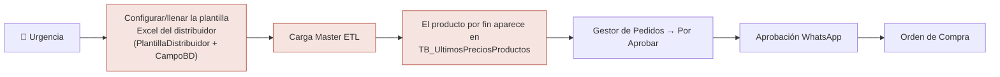
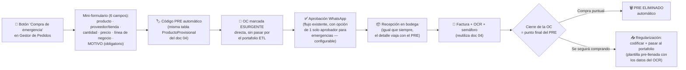

# FARMY — Compras de emergencia (fast-track sin ETL)

Complemento de los docs [03](03-costeo-real-cotizaciones.md) y [04](04-codigo-pre-y-ocr-facturas.md). Mismo espíritu, ahora en el **módulo de Compras**: reutiliza el código PRE, el OCR y la semaforización ya especificados.

---

## 1. El problema

Una **compra de emergencia o contingencia** (se acabó un producto, hay que salir a comprarlo ya) hoy exige el camino largo:

Los tres pasos rojos existen porque el flujo normal **solo sabe comprar lo que está en el portafolio ETL**: `PorAprobar` exige `IdPrecio`, `IdHomologo`, `IdConvenio` (llaves del portafolio), y el buscador del Gestor de Pedidos solo lee `TB_UltimosPreciosProductos`. Para una compra recurrente eso está bien (garantiza comparación de precios); para una emergencia es un bloqueo.

---

## 2. La solución: canal "Compra de emergencia"

Un camino corto, **paralelo y controlado**, que se salta la ETL pero no los controles:

**Idea central:** la emergencia no elimina los controles, los **difiere**. Se compra ya, y la formalización (codificación, portafolio, comparación de precios) ocurre después, con los datos que la factura y el OCR ya capturaron — en lugar de digitarlos dos veces.

---

## 3. Reglas del canal de emergencia

1. **Permiso propio:** acción `COMPRA_EMERGENCIA` (`[RequiereAccion]` + directiva `hasAction`). No todo el mundo puede saltarse el portafolio.
2. **Motivo obligatorio y auditable:** sin motivo no hay OC de emergencia. Queda en la bitácora de la OC (patrón `OrdenCompraBitacora` existente).
3. **Marcada visualmente:** la OC lleva bandera `EsEmergencia` y chip 🚨 en todas las pantallas (gestor, estados, recepción), para que nadie la confunda con una compra de portafolio.
4. **Aprobación no se elimina:** sigue el flujo WhatsApp existente (`PENDIENTE_1 → PENDIENTE_2 → APROBADA/RECHAZADA`), con una opción de configuración para que las emergencias requieran **un solo aprobador** (`WhatsApp:AprobadorEmergencia`), acelerando sin perder el control de 4 ojos.
5. **Alerta de precio:** si el producto se parece a uno del portafolio (por código de barras o similitud de nombre), el sistema muestra el último precio conocido y semaforiza la diferencia — evita pagar 3× por afán sin darse cuenta. Si no hay referencia, se marca "sin referencia de precio".
6. **El PRE se cierra al cerrar la OC** (recepción completa): puntual → `ELIMINADO` automático; recurrente → exige regularización (regla equivalente a la remisión en el flujo comercial del doc 04).
7. **Tope configurable (opcional):** monto máximo por OC de emergencia y/o por mes (`Compras:TopeEmergenciaMes`); superarlo exige el flujo normal o doble aprobación.

---

## 4. La regularización: de emergencia a portafolio sin digitar dos veces

Cuando el producto **se va a seguir comprando**, hoy tocaría llenar la plantilla ETL completa a mano. Con este diseño, al cerrar la OC:

1. El sistema arma una **fila de plantilla pre-llenada** con lo que ya sabe: nombre, fabricante/laboratorio, código de barras real (de la recepción), precio real (del OCR de la factura), IVA, distribuidor/proveedor.
2. El usuario de compras solo **revisa y completa lo que falte** (homólogo, convenio si aplica) — minutos, no el proceso largo.
3. Se codifica con el flujo existente de Codificaciones (`Por confirmar → Confirmado`) y entra al portafolio; el mapeo PRE → código definitivo queda guardado.
4. La siguiente compra de ese producto ya es por el flujo normal.

> La plantilla larga no desaparece: sigue siendo el camino para cargas masivas de distribuidores. Lo que se elimina es tener que usarla **para un solo producto con afán**.

---

## 5. Cambios técnicos (reutiliza casi todo lo de docs 03–04)

### Base de datos (delta pequeño)

| Cambio | Detalle |
|---|---|
| `OrdenCompraEncabezado` | + `EsEmergencia` (bit), `MotivoEmergencia` (nvarchar 400) |
| `ProductoProvisional` (ya existe en doc 04) | + `Origen` (COTIZACION \| COMPRA_EMERGENCIA) y `IdOrdenCompraEncabezado?` — la misma tabla sirve a los dos flujos |
| `PorAprobar` | Las llaves de portafolio (`IdPrecio`, `IdHomologo`, `IdConvenio`) pasan a **nullables** solo para filas de emergencia — o alternativa sin tocar el esquema: la OC de emergencia **no pasa por PorAprobar** y nace directo en `OrdenCompraEncabezado` (recomendado: menos invasivo) |

### API

| Método | Ruta | Qué hace |
|---|---|---|
| `POST` | `/api/OrdenCompra/emergencia` | Crea OC de emergencia: mini-formulario + genera PRE + dispara aprobación WhatsApp (1 o 2 niveles según config) |
| `GET` | `/api/OrdenCompra?esEmergencia=true` | Filtro para el reporte |
| `PUT` | `/api/ProductoProvisional/{id}/regularizar` | Genera la fila de plantilla pre-llenada (datos de recepción + OCR) y la deja lista para revisión |

### Front

- Botón **"🚨 Compra de emergencia"** en Gestor de Pedidos (visible con `COMPRA_EMERGENCIA`) → mini-formulario de 6 campos.
- Chip 🚨 en las grids de OC, estados y recepción.
- Al cerrar la OC recurrente: pantalla de regularización pre-llenada (revisar → confirmar → codificar).
- **Reporte de emergencias** (pestaña en Órdenes de Compra o tarjeta en el Dashboard): cuántas, por cuánto, por quién, motivos — para que el canal rápido no se vuelva el canal normal.

---

## 6. Entrega (continúa la numeración del plan maestro)

**ENTREGA 8 — Compra de emergencia (2–3 días)** · Depende de: Entrega 5 (código PRE) y opcionalmente 6 (OCR para la regularización pre-llenada).

- [ ] 8.1 BD: `EsEmergencia` + `MotivoEmergencia` en OC; `Origen` en `ProductoProvisional`
- [ ] 8.2 `POST /api/OrdenCompra/emergencia` + acción `COMPRA_EMERGENCIA` + aprobación WhatsApp configurable a 1 nivel
- [ ] 8.3 Botón + mini-formulario en Gestor de Pedidos; chips 🚨 en las grids
- [ ] 8.4 Alerta/semáforo de precio contra el portafolio cuando hay producto similar
- [ ] 8.5 Cierre de OC = cierre del PRE (eliminar o regularizar); regularización pre-llenada con datos de recepción + OCR
- [ ] 8.6 Reporte de compras de emergencia

**Criterio de aceptación:** una compra urgente pasa de "necesito esto ya" a OC aprobada en **minutos** (6 campos + 1 aprobación), sin tocar la plantilla ETL, y al cerrar no queda ni un PRE huérfano ni un producto recurrente sin regularizar.

---

## 7. Decisiones por confirmar

1. ¿Aprobación de emergencia con **1 solo aprobador** o mantener los 2 niveles? (Propuesta: 1, configurable.)
2. ¿Tope de monto por OC de emergencia y/o mensual? (Propuesta: sí, configurable, empezar sin bloquear — solo alertar.)
3. ¿La OC de emergencia nace directo (recomendado) o pasa por `PorAprobar` con llaves nullables?
4. ¿La regularización es obligatoria al cerrar la OC (bloqueante) o puede quedar pendiente con recordatorio? (Propuesta: bloqueante solo si se marcó "se seguirá comprando".)
